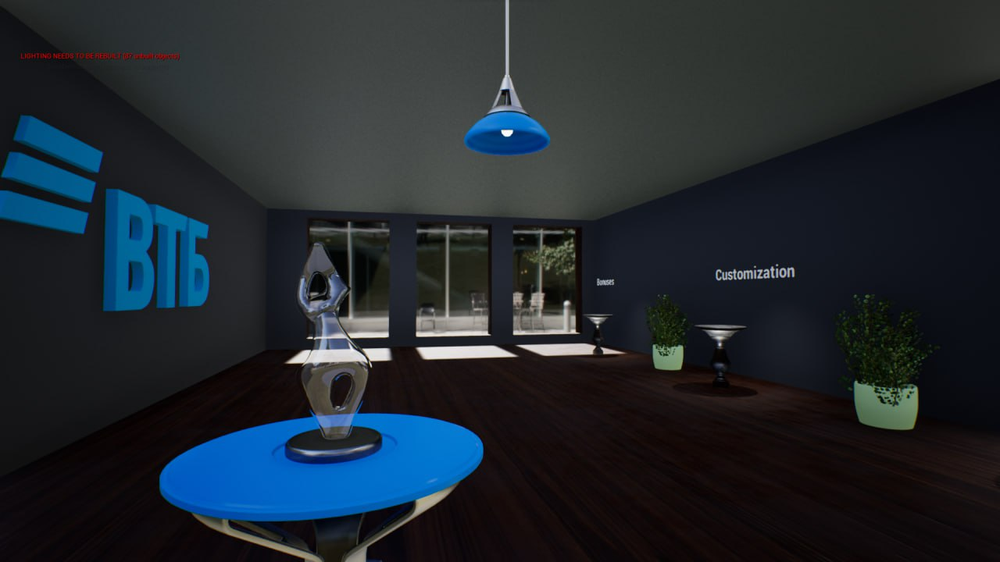
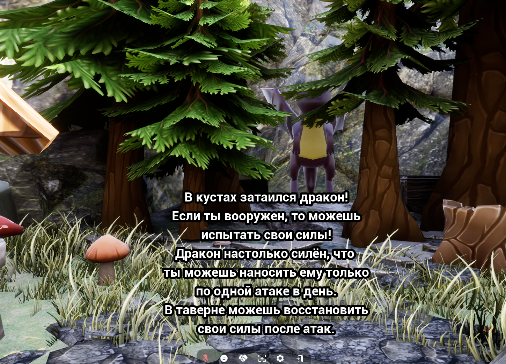

# Команда Fadee

# Ссылка на .zip с проектом
```
https://cloud.mail.ru/public/12AA/FrSe4G9Sf
```

# Как запустить проект
```
1. Открыть проект в "Editor Unreal Engine 4.27"
2. Перейти в каталог "Content"
3. Перейти в каталог "Main"
4. Перейти в каталог "Map"
5. Далее предполагается просмотр локаций, каждую следует открывать отдельно
6. Существует еще одна локация "Bank", которая находится по следующему пути: "Content/StarterContent/Maps"
```

# Скришоты path локаций


# Локации
- Medieval (средневековье)
- MiniMap (изометрическая карта со всеми локациями)
- NewHub (основной hub пользователя, банк)

# Банк (скриншоты)



# Средневековье (скриншоты)



